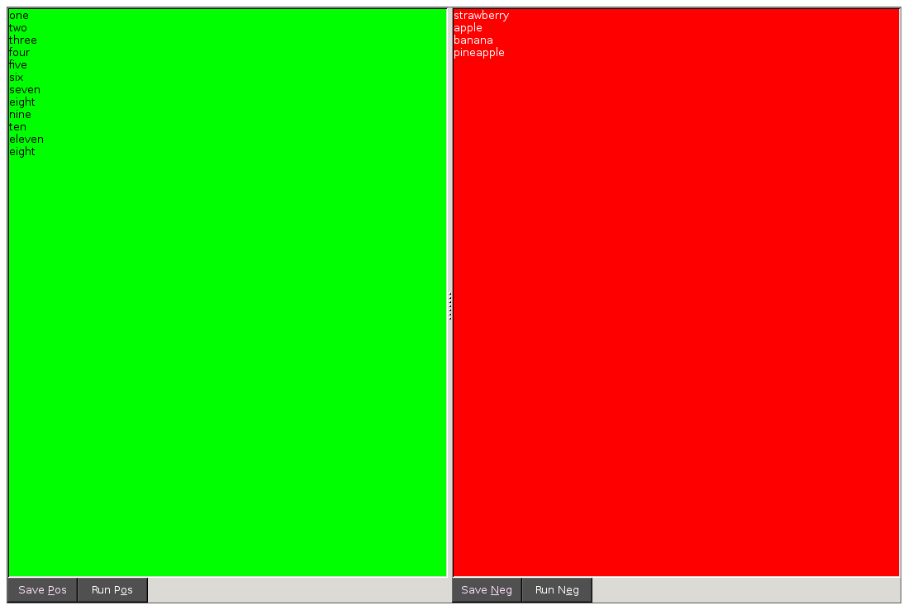

# wxPython Two Pane Editor

This example app demonstrates how to

- lay out multiple wxWidgets panels
- add saving functionality (save to different files)
- connect external processes to UI actions (running scripts etc.)
- style user interface elements

